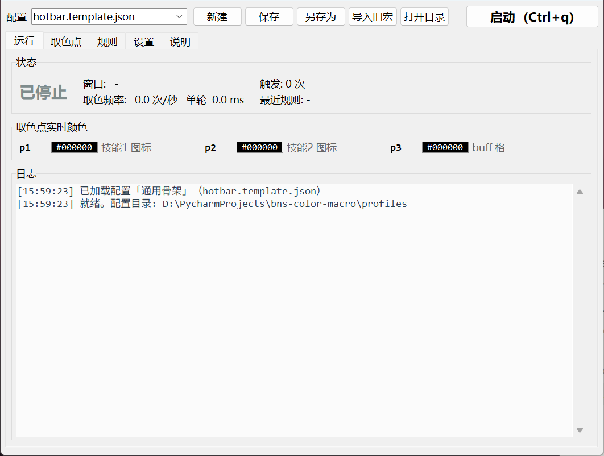
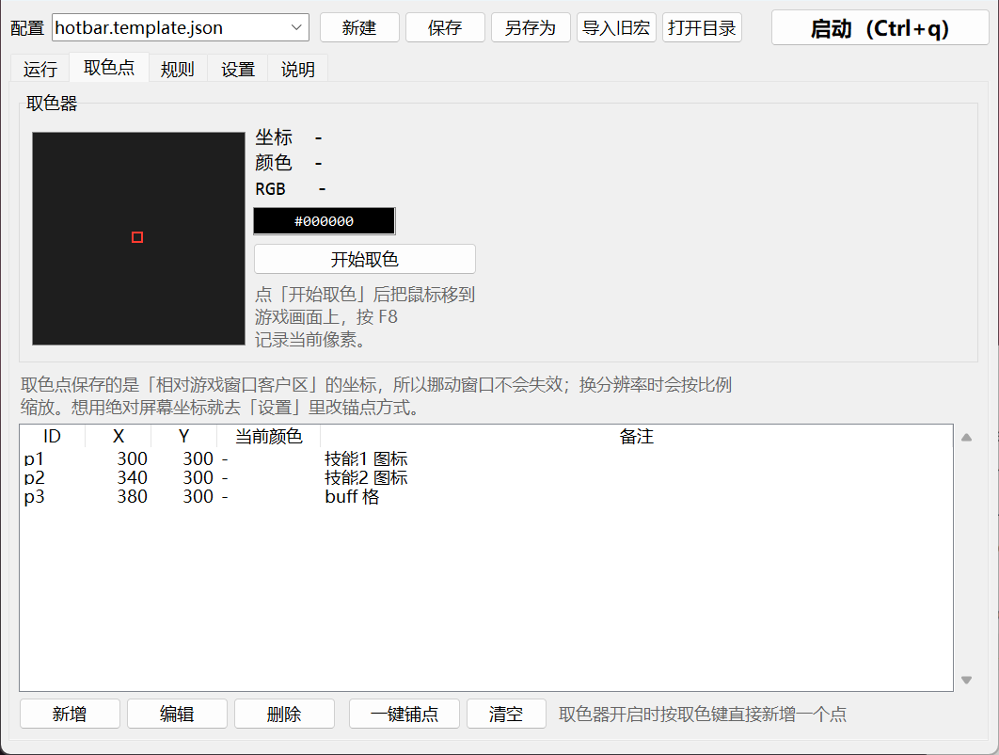
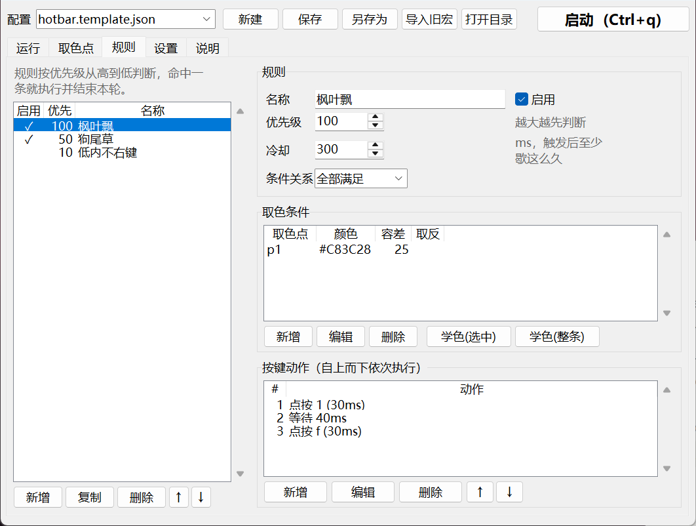
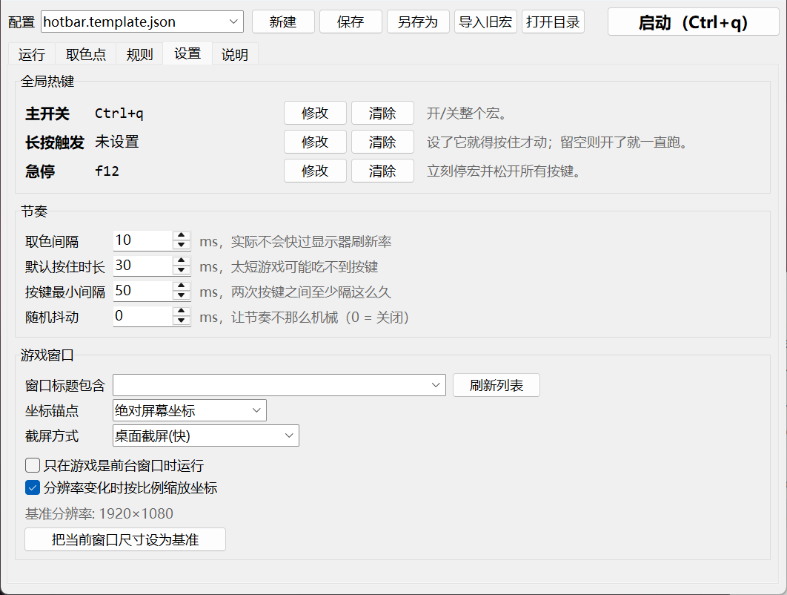

# 剑灵取色宏 · bns-color-macro

一个**自己拿得住源码**的取色宏：盯住屏幕上几个像素点，颜色对上了就按你指定的键。

市面上的取色宏都是打包好的 exe —— 取色点存在哪、按什么顺序按、判断逻辑长什么样，
你都看不见，想改一个延迟都得等作者更新。这个项目把同样的事情重写了一遍：
引擎 1700 行 Python、界面 1500 行，规则是一个你能用记事本打开的 JSON，
主循环短到能一口气读完。

> ⚠️ 自动化按键可能违反游戏的用户协议。用不用、怎么用，自己拿主意。



---

## 它能做什么

- **取色**：鼠标指哪按 F8，就记下那个像素的坐标和颜色。带 9 倍放大镜，逐像素对准。
- **一键铺点**：技能栏是等距的 —— 对准第一格按一次、最后一格按一次，中间的点自动铺开。
  8 个格子从点 8 次变成点 2 次。
- **一键学色**：把游戏摆成你想让它触发的样子，点「学色(整条)」，
  当前画面的颜色直接写进条件，不用手敲 `#RRGGBB`。
- **规则**：`若干取色点的颜色满足条件 → 按一串键`。支持
  多条件（全部满足 / 任一满足 / 取反）、优先级、每条规则独立冷却。
- **动作**：点按、按住、松开、等待、相对移动鼠标（转视角），可以串成连招。
- **热键**：主开关 / 长按触发 / 急停，支持鼠标侧键（前进键、后退键、中键）。
- **坐标锚定**：取色点存的是**相对游戏窗口客户区**的坐标，挪动窗口不失效，
  换分辨率按比例缩放。
- **多套配置**：一个职业一个 JSON，下拉框切换。
- **导入旧宏**：能把旧宏 `data/settings.json` 里的热键和节奏搬过来。

主开关和长按触发键是**两个独立的开关**：主开关（默认 Ctrl+Q）管整个宏的死活，
长按键只管"现在打不打"。松开长按键不会把宏关掉，再按住就接着跑。
没设长按键的话，开了就一直跑。

| 取色 | 规则 | 设置 |
|---|---|---|
|  |  |  |

---

## 快速开始

需要 Windows + Python 3.9 以上（tkinter 是 Python 自带的，不用另装）。

```bash
git clone https://github.com/zq940222/bns-color-macro.git
cd bns-color-macro
pip install -r requirements.txt
python run.py
```

然后：

1. 把游戏切成**窗口模式**或**无边框窗口**。
2. 「设置」→ 点「刷新列表」选中游戏窗口 → 点「把当前窗口尺寸设为基准」。
3. 「取色点」→「一键铺点」→ 对准第一个技能图标按 **F8**，对准最后一个按 **F8**。
4. 「规则」→ 选中规则 → 把游戏摆成要触发的状态 → 点「学色(整条)」→ 勾上「启用」。
5. 回「运行」，按 **Ctrl+Q** 开始。

首次启动会自动加载 `profiles/hotbar.template.json`（通用骨架：8 个技能格 → 按键 1-8），
之后每次启动加载你上次用的那份。

想打包成单个 exe：`pip install pyinstaller && python tools/build_exe.py`。
（不过直接跑源码更省事，也不会被杀毒软件误报。）

---

## 配置文件长什么样

`profiles/*.json`，可以直接手改：

```jsonc
{
  "name": "召唤师",
  "settings": {
    "tick_ms": 10,            // 取色间隔
    "key_hold_ms": 30,        // 默认按住多久
    "key_interval_ms": 50,    // 两次按键之间至少隔多久
    "anchor_mode": "client",  // client = 跟随窗口, screen = 绝对坐标
    "reference_size": [1920, 1080]
  },
  "hotkeys": {
    "toggle": { "key": "q", "modifiers": ["ctrl"], "mode": "toggle" },
    "hold":   { "key": "x2", "mode": "hold" }        // x2 = 鼠标前进键
  },
  "probes": [
    { "id": "p1", "x": 780, "y": 1010, "note": "技能格1" }
  ],
  "rules": [
    {
      "id": "r1", "name": "技能1 就绪就放",
      "priority": 100, "cooldown_ms": 200, "match": "all",
      "conditions": [
        { "probe": "p1", "color": "#C8A032", "tolerance": 30, "negate": false }
      ],
      "actions": [
        { "type": "key",   "key": "1", "hold_ms": 30 },
        { "type": "delay", "ms": 60 },
        { "type": "key",   "key": "f", "hold_ms": 30 }
      ]
    }
  ]
}
```

`profiles/summoner.template.json` 是一份带注释的示例（坐标和颜色是占位值，要自己重取）。

**按键名**：`a`–`z`、`0`–`9`、`f1`–`f24`、`space`、`enter`、`esc`、`tab`、
`shift` / `ctrl` / `alt`、方向键 `up` `down` `left` `right`、小键盘 `num0`–`num9`，
中文别名 `空格` `回车` `小键盘3` 也认。
鼠标是 `mouseleft` `mouseright` `mousemiddle` `x1`（后退键）`x2`（前进键），
或者写 `左键` `右键` `侧键1` `前进键`。

> 注意 `left` / `right` 是**方向键**，鼠标左右键要写 `mouseleft` / `mouseright`。

---

## 为什么没有内置的职业宏

因为**做不出来能直接用的**。取色点的坐标取决于你的分辨率和技能栏摆法，颜色取决于
画质设置和有没有 UI 插件，按哪个键取决于你自己怎么绑——三样没有一样是通用的。

参考的那个宏也不内置：它 `data/ma_feng.json` 里的 `colors` 字段就是空的
`[{},{},{}]`，说明书里那句"对着怪按 F1 一下"，意思就是让你自己取。

所以内置的是**骨架 + 省力工具**：`hotbar.template.json` 给 8 个技能格对应按键 1-8、
优先级从上到下排好，坐标是 1920×1080 的占位值、颜色全部待取（容差 0 = 永不命中）、
规则默认全关——所以直接启动它不会乱按键。铺点 + 学色 + 启用，三步就变成你自己的宏。

## 目前不做什么

这个项目只做**取色 → 按键**这一件事，做扎实。原版宏里的这些功能没有实现：

- 自动清怪 / 刷怪（转视角找怪、怪物匹配度、自动捡箱子、自动切线、防跳保护）
- 自动背包分解、自动换装、切频道、点龙脉
- 技能计时器（语音提示 / 打字提示）

不是做不了 —— 转视角需要的 `move_relative` 已经在 `input.py` 里，规则引擎也能承载 ——
只是这些属于"自动打怪"而不是"取色宏"，摊开做会让核心变糊。要加的话从
`engine.py` 的规则循环往外长就行。

## 三个你会撞上的 Windows 事实

写这个东西的时候量过，写下来免得你重新踩一遍。

**① 取色频率的上限就是显示器刷新率。**
GDI 从屏幕 DC 上 BitBlt 一次会阻塞到下一次垂直同步 —— 60Hz 的屏就是 16.7ms 一次，
`GetPixel` 也一样。所以把「取色间隔」调到 0 也不会更快。

真正要命的是：**这个开销是按「调用次数」算的，不是按面积算的。**
实测 200×200 和 1920×1080 都是 ~16.7ms。十个取色点如果分十次 `GetPixel`，
一轮就是 167ms —— 宏直接废掉。所以引擎每轮只截**一个**能盖住所有取色点的矩形，
再从这块 numpy 数组里取像素。

**② 独占全屏读不到像素。** DirectX 独占全屏下截屏拿到的是全黑。必须窗口模式或无边框窗口。

**③ `time.sleep` 默认只有 ~15.6ms 精度。** 不调 `timeBeginPeriod(1)` 的话，
你写的 10ms 间隔实际是 16ms，而且抖得厉害。程序启动时就调了，不然卡刀节奏根本不准。

另外两个静默失败点，也都处理了：
- **DPI**：不声明 per-monitor DPI aware，缩放显示器上取色时的坐标和运行时读的坐标对不上。
- **按键方式**：只用 `SendInput` + **扫描码**。DirectInput 客户端读的是 raw input，
  虚拟键码和 `PostMessage` 它根本不理。

---

## 代码结构

```
bnsmacro/
  winapi.py    ctypes 绑定、DPI、高精度计时器
  capture.py   GDI 截屏（一次一个矩形，直接出 numpy）
  keys.py      按键名 ↔ 虚拟键码 / 扫描码
  input.py     SendInput（扫描码），带 release_all 兜底
  hotkey.py    WH_KEYBOARD_LL / WH_MOUSE_LL 全局钩子
  window.py    找游戏窗口、客户区坐标换算
  profile.py   数据模型 + JSON 读写
  engine.py    主循环：截屏 → 判断 → 执行
  importer.py  旧宏 settings.json 导入
  ui/          tkinter 界面
```

自己注入的按键都在 `dwExtraInfo` 里打了 `INJECT_TAG`，钩子会跳过 ——
不然宏按出来的键会把宏自己再触发一遍。停止时 `release_all()` 会把还按着的键全松开。

跑测试：

```bash
python -m unittest discover -s tests -v
```

---

## 测到哪一步

上面那些取色耗时数字，是在 60Hz 桌面上实测的（`BitBlt` 16.7ms/次，`GetDIBits`
0.012ms，`SendInput` 扫描码注入、全局钩子、热键分发、急停打断都跑通了）。

**但是：还没有对着运行中的剑灵客户端验证过。** 具体这个客户端在窗口模式下能不能
被 `BitBlt` 读到、UI 元素的颜色够不够稳定，需要你自己跑一遍确认。
第一次用先只配一条规则，在「运行」页盯着实时颜色看数值稳不稳，再往上加。

## 常见问题

**取到的颜色全是黑的** → 游戏在独占全屏，换成窗口模式。

**按键没反应** → 游戏可能以管理员身份运行；本程序也要用管理员身份运行，
否则 `SendInput` 会被 UIPI 挡掉。

**热键没反应** → 同上。另外检查热键有没有和游戏内按键撞车。

**打包出来的 exe 被杀毒拦了** → PyInstaller + SendInput + 键盘钩子，
这套组合必然触发启发式规则。直接 `python run.py` 跑源码就没这问题。

**换了分辨率/UI 插件后不准了** → 等比缩放的前提是游戏 UI 本身等比缩放。
改过 UI 缩放的话，重新取一次色最稳。

---

## 和原版宏的关系

这是一个**从零写的**实现，不是反编译。参考的只有两样东西：
那个宏自己写在 `data/` 目录里的明文 JSON（热键、节奏这些设置项），
以及它附带的说明文本里描述的取色流程。打包的可执行文件没有被解包或反编译，
里面的颜色数据也没有被提取 —— 所以取色点必须你自己重新取。

`importer.py` 能读旧宏的 `data/settings.json`，把热键和按键间隔搬过来，省一点重新设置的功夫。

## License

MIT
